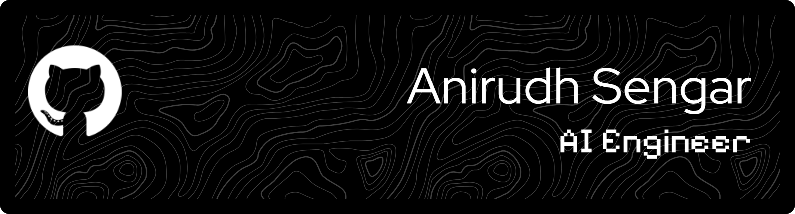

## About Me

I am an AI and Machine Learning professional focused on designing scalable, production-grade systems. My expertise lies in orchestrating multi-agent architectures, optimizing retrieval-augmented generation (RAG) pipelines, and implementing interpretable deep learning models. I specialize in bridging the gap between theoretical research and operational software, delivering robust solutions for complex technical challenges.

## Selected Projects

### [The Reverse Tutor](https://github.com/anirudhsengar/TheReverseTutor)
**Real-Time AI Pedagogical Assistant**
*   **Core Technology**: React 19, FastAPI, LangGraph, Deepgram
*   **Description**: An interactive teaching tool implementing the Feynman Technique through Socratic dialogue.
*   **Key Features**:
    *   Orchestrates complex conversational states using finite state machines to challenge user understanding rather than providing direct answers.
    *   Features a decoupled architecture with a WebSocket-enabled low-latency audio pipeline.
    *   Implements strict Voice Activity Detection (VAD) for natural, interruption-free turn-taking.

### [MathVizAI](https://github.com/anirudhsengar/MathVizAI)
**Autonomous Educational Video Generation Pipeline**
*   **Core Technology**: Python, Multi-Agent Systems, Manim, RAG
*   **Description**: An end-to-end system that autonomously generates polished mathematical explainer videos from text prompts.
*   **Key Features**:
    *   Coordinates specialized agents (Solver, Evaluator, Developer) to ensure mathematical rigor and code correctness.
    *   Utilizes a self-correcting "Golden Set" RAG mechanism to retrieve and validate animation code patterns.
    *   Integrates VibeVoice for natural neural text-to-speech synthesis synchronized with generated visuals.

### [TelegramTradingBot](https://github.com/anirudhsengar/TelegramTradingBot)
**LLM-Driven Algorithmic Trading Executor**
*   **Core Technology**: Python, MetaTrader 5, OpenAI GPT-4o, Telethon
*   **Description**: Automated trading engine that parses unstructured signals from Telegram channels to execute trades on MetaTrader 5.
*   **Key Features**:
    *   Uses GPT-4o to extract structured trade parameters (Symbol, Side, SL/TP) from natural language messages.
    *   Implements strict risk management validation and stale-message filtering.
    *   Maintains concurrent state for position management and duplicate signal prevention.

### [Codebase Indexer](https://github.com/anirudhsengar/CodebaseIndexer)
**Semantic Code Search Engine**
*   **Core Technology**: Python, Tree-Sitter, FAISS, OpenAI Embeddings
*   **Description**: A production-ready indexing tool for semantic search across large repositories.
*   **Key Features**:
    *   Implements AST-based chunking via Tree-Sitter to preserve semantic context of functions and classes.
    *   Uses Merkle tree data structures to enable efficient, incremental updates of the vector index.
    *   Supports over 25 languages with intelligent fallback strategies for non-code assets.

### [VitAI](https://github.com/anirudhsengar/VitAI)
**Autonomous Repository Analysis Agent**
*   **Core Technology**: Python, Google Gemini, ReAct Pattern
*   **Description**: An intelligent agent capable of exploring and analyzing GitHub repositories to answer complex structural questions.
*   **Key Features**:
    *   Follows a Reasoning-Acting (ReAct) loop to autonomously plan and execute investigation steps.
    *   Retrieves real-time file content and directory structures to ground answers in actual codebase facts.
    *   Eliminates hallucination by relying on direct tool usage for information gathering.

### [Aura](https://github.com/anirudhsengar/Aura)
**Explainable AI (XAI) Investment Platform**
*   **Core Technology**: TensorFlow (LSTM), SHAP, Streamlit, Yahoo Finance
*   **Description**: A comprehensive backtesting and trading analysis platform integrating Explainable AI.
*   **Key Features**:
    *   Deploys Long Short-Term Memory (LSTM) networks for predictive market modeling.
    *   Integrates SHAP (Shapley Additive Explanations) to provide feature-level transparency into model decision-making.
    *   Provides professional-grade metrics including Sharpe ratio, max drawdown, and profit attribution.

### [Diabetes Predictor](https://github.com/anirudhsengar/DiabetesPredictor)
**Clinical Risk Assessment Model**
*   **Core Technology**: Scikit-learn, Pandas, Streamlit, Tabula
*   **Description**: A diagnostic support tool for predicting diabetes risk based on medical biomarkers.
*   **Key Features**:
    *   Implements Multiple Linear Regression trained on the PIMA Indian dataset.
    *   Features a dual-mode interface for both manual data entry and automated PDF medical report parsing.

## Technical Proficiency

**Languages**
    

**Frameworks & Libraries**
    

**Cloud & Infrastructure**
    

    
<i>Building intelligence into architecture.</i>

