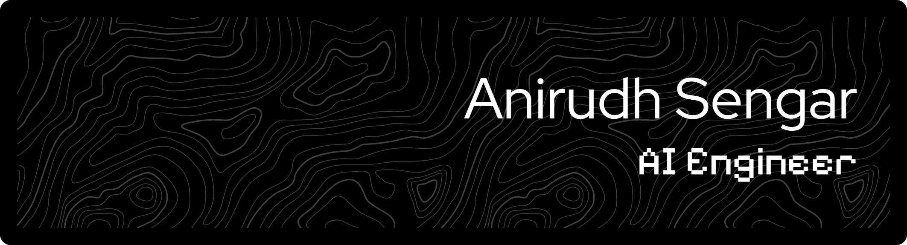

## About Me

AI Engineer specializing in building and deploying machine learning systems at scale. I focus on developing intelligent solutions that bridge the gap between research and production, with expertise in deep learning, natural language processing, and computer vision.

**Current Focus:** Large Language Models • Neural Networks • MLOps  
**Interests:** AI Research • Model Optimization • Ethical AI

## Technical Skills

### AI & Machine Learning

## Education & Certifications

**B.Tech in Computer Science & Engineering**
- Specialization in Cloud Computing & Virtualization Technology

**Relevant Certifications**
- AWS Certified Solutions Architect – Associate
- Deep Learning Specialization
- Machine Learning Engineering

## Professional Experience

**AI Engineer**
- Designed and deployed machine learning models for production environments
- Built end-to-end ML pipelines for data processing and model training
- Implemented MLOps best practices for model monitoring and deployment
- Developed NLP solutions using transformer models and LLMs

**Key Projects**
- Developed recommendation systems using collaborative filtering and deep learning
- Built computer vision applications for image classification and object detection
- Created conversational AI systems using large language models
- Implemented time-series forecasting models for predictive analytics

### 📄 [Download My Resume](./Anirudh_Sengar_CV.pdf)
